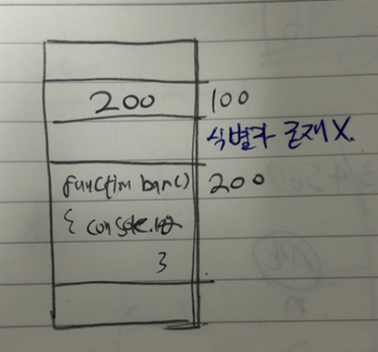
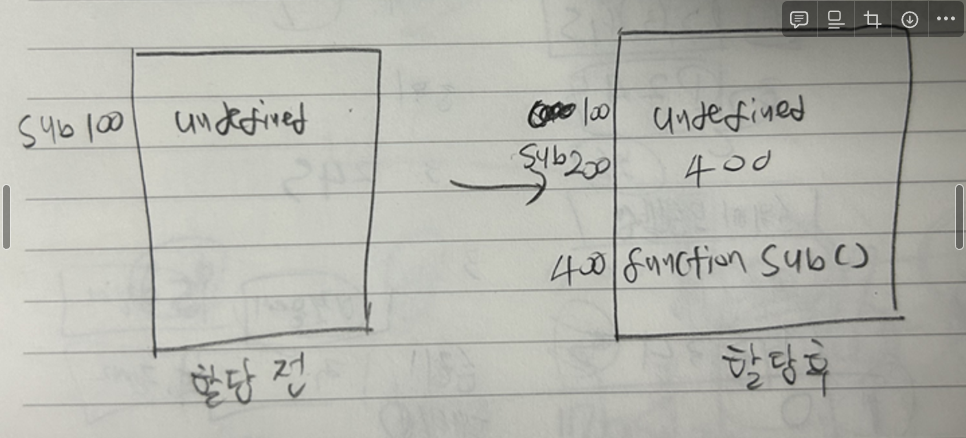

# [12장]함수

---

## 함수란?

입력을 받아 출력을 내보내는 과정을 정의한것이다.

재료를 투입해 어떤 결과를 만들어내는 역활을 하는 기계와 같다고 생각해볼 수 있다.

```jsx
function add(x,y){  // add -> 함수 이름 x,y는 파라미터,매개변수라고 부름
	return x + y; //반환값
}
//1,2,3을 함수라고 부르고
//함수 이름과 인수를 넣어 호출이 가능하다
add(2,5); //2,5는 인수 or 인자
```

함수는 정의를 통해 생성한다.

```jsx
function add(x,y){
	return x+y;
}
```

정의된 함수는 호출을 해야 사용이 가능하다

```jsx
var result = add(2,5);
//7
```

## 함수를 사용하는 이유

함수는 반복적인 작업을 하나의 과정으로 묶어 사용하기만 하면 되므로 코드의 재사용이라는 측면에서 매우 유용하다.

- 함수의 장점
    - 중복되는 코드속에서 실수를 방지할수 있다 → 코드 신뢰성 증가
    - 중복되는 코드를 줄여 수정에 걸리는 시간을 줄인다 → 유지보수 편의성 증가

## 함수 리터럴

자바스크립트의 함수는 객체 타입의 값이다.

객체는 리터럴값으로 표현이 가능하다

즉, **함수도 리터럴로 표현**할 수 있다.

함수 리터럴은 function 키워드, 함수 이름, 매개변수 목록, 함수 몸체로 구성된다.

### 함수 리터럴 구성 요소

- 함수이름
    - 함수 이름은 식별자다. 따라서 식별자 네이밍 규칙을 준수해야 한다.
    - 함수 이름은 함수 몸체내에서만 참조할 수 있는 식별자다.
    - 함수 이름은 생략할 수 있다.
        - 이름이 있는 함수 → 기명 함수(named function)
        - 이름이 없는 함수 → 무명/익명함수(anonymous function)
- 매개변수 목록
    - 0개이상의 매개변수를 소괄호로 감싸고 쉼표로 구분한다
    - 각 매개변수에는 함수를 호출할때 지정한 인수가 순서대로 할당된다. 즉, 매개변수 목록은 순서에 의미가 있다.
    - 매개변수는 함수 몸체내에서 변수와 동일하게 취급된다. 따라서 변수와 마찬가지로 식별자 네이밍 규칙을 준수해야한다.
- 함수 몸체
    - 함수가 호출 되었을때 일괄적으로 실행될 문들을 하나의 실행단위로 정의한 코드 블록이다.
    - 함수몸체는 함수 호출에 의해 실행된다.

리터럴은 약속된 기호를 사용해 값을 생성하는 표기 방식이다

함수 리터럴도 평가되어 값을 생성하며, 객체타입의 값을 생성한다고 할수 있다.

따라서 함수는 객체이다.

함수는 객체라고 할 수 있지만 일반 객체와는 다르다.

일반 객체는 호출할 수 없지만, 함수는 호출이 가능하다.

또한 일반객체에는 없는 함수 객체만의 고유한 프로퍼티를 갖는다.

## 함수 정의

함수를 호출하기 이전에 매개변수, 실행할 문장, 그리고 반환값을 지정하는것을 말한다

자바스크립트 엔진은 함수 리터럴에 맞게 평가하고 평가가 끝나면 함수객체가 된다.

### 함수를 정의하는 방법

1. 함수 선언문

```jsx
function add(x,y){
	return x+y;
}
```

1. 함수 표현식

```jsx
var add = function(x,y){
		return x+y
}
```

1. Function 생성자 함수

```jsx
var add = new Funtion('x','y','return x+y');
```

1. 화살표 함수(ES6)

```jsx
var add = (x,y)=> x+y;
```

### 변수 선언과 함수 정의

c언어에서 “정의”는 실제 메모리에 올라가는가를 정의라고 하는데, 자바스크립트는 선언과 동시에 암묵적으로 메모리에 올라가기때문에 정의가 모호하다

ECMA에서 변수는 선언 , 함수는 정의로 용어를 정해서 변수는 선언 함수는 정의로 용어를 구분하고간다

### 함수 선언문

```jsx
function add(x,y){
	return x + y
}
```

함수 선언문은 함수 리터럴과 형태가 동일하다. 하지만 함수 리터럴은 함수 이름을 생략할수 있으나 함수 선언문은 이름을 생략할 수 없다.

```jsx
funcion (x,y){
	return x+y
}
//function name 에러 발생
```

함수 선언문은 표현식이 아닌 문이다.


브라우저에 함수 선언문을 입력하면 undefined가 출력된다.

표현식인 문이라면 완료값 undefined 대신 표현식이 평가되어 생성된 함수가 출력되어야한다

```jsx
var add = function add(x,y){
	return x + y;
}

//console.log(add(2,5)) //7
```

위 문장을 보면 함수 선언문이 객체를 리턴해서 호출이 가능해진다 왜 그럴까?

**자바스크립트는 문장을 해석**한다

{}의 경우 코드 블럭인지 객체 리터럴인지를 판단한다.

**대입연산자가 있는 경우 오른쪽이 함수 리터럴이 되도록, 없으면 함수 선언문이 되도록 해석해준다.**

```jsx
function foo(){
     console.log('foo');
}

foo(); //foo

(function bar(){console.log('bar')}); //피연산자로 인식해 값으로 평가되어야하는 함수 리터럴로 해석된다.
bar(); // not defined
```

함수 선언문으로 생성된 foo는 호출할 수 있으나, 함수 리터럴 표현식으로 생성된 bar는 호출할 수 없다.



메모리를 간단하게 그려보면 위와 같이 **함수 리터럴로 함수를 정의할 경우** 메모리에 식별자가 존재하지 않아 호출할 수 없다.


함수 선언문으로 정의한 foo 함수의 경우는 함수를 호출할 수 있었다.

이유는 함수 이름이 식별자로 메모리내에 저장되어 있기때문이다.

이를 통해 자바스크립트 엔진은 생성된 함수를 호출하기 위해 함**수 이름과 동일한 이름의 식별자를 암묵적으로 생성**하고 거기에 함수 객체 주소를 할당한다.

위 메모리를 코드로 반환해보면 아래와 같은 형태를 띈다.

```jsx
var add(식별자) = function add(함수이름)(x,y){
	 return x+y;
}

console.log(add(식별자)(2,5))
```

**함수는 함수이름으로 호출하는것이 아니라 함수 객체를 가리키는 식별자로 호출된다**

## 함수 표현식

```jsx
//함수 표현식
var add = function(x,y){
	return x+y;
}

console.log(add(x,y));
```

값의 성질을 갖는 객체를 일급 객체라고 한다

자바스크립트의 함수는 일급 객체이다.

이말은 함수를 값처럼 자유롭게 사용할수 있다는 것이다.

함수는 일급객체이므로 함수 리터럴로 생성한 함수 객체를 변수에 할당할 수 있다.

위처럼 익명함수는 특정 메모리에 존재하게되고, add식별자가 익명함수주소를 참조하게된다.

```jsx

var add = function foo(x,y){
	return x + y;
}
//함수 객체를 가리키는 식별자로 호출
console.log(add(2,5));

//함수 이름으로 호출하면 ReferenceError가 발생
//함수 이름은 함수 몸체 내부에서만 유효한 식별자다
console.log(foo(2,5));
```

- 함수 선언문
    - 표현식이 아닌 문
- 함수 표현식
    - 표현식인 문 → 좌항,우항과 같이 평가되어지는 문장

<aside>
💡 함수를 호출하기위해서는 함수 선언문은 함수를 정의하기만 하면 함수이름이 식별자이름으로 암묵적으로 메모리에 저장되지만
함수 표현식은 함수이름으로 된 객체만 생성될뿐 호출을 해주기 위해서는 식별자를 선언해줘야한다.

</aside>

### 함수 생성 시점과 함수 호이스팅

```jsx
console.dir(add); //f add(x,y);
console.dir(sub); //undefined

console.log(add(2,5);
console.log(sub(2,5)); //sub is not a function

function add(x,y){
	return x + y;
}

var sub = function(x,y){
	return x-y;
}
```



- 함수 선언문
    - 런타임 이전에 자바스크립트 엔진에 의해 먼저 실행된다.
    - 런타임 이전에 엔진에 의해 함수 객체를 선언하고 암묵적으로 식별자를 생성하고 생성된 함수 객체를 할당한다
- 함수 표현식
    - var 변수로 선언된 키워드는 식별자로 이미 선언되어 undefined 값을 가진다
    - 변수 할당문의 값은 할당문이 실행되는 시점에 평가되어 함수 객체가 된다.

함수 표현식으로 함수를 정의하면 함수 호이스팅이 발생하는것이 아니라 변수 호이스팅이 발생한다.

함수 호이스팅은 함수가 선언되고나서 호출된다는 개념을 무시하기때문에 함수 표현식을 사용하는것을 권장한다.


## Function 함수

생성자 함수는 객체를 생성하는 함수를 말한다.

- 생성자 함수 객체 생성 방식

```jsx
var add = new Function('x','y','return x + y');
console.log(add(2,5)); //7
```

<aside>
💡 **즉시 실행 함수**

</aside>

아래와 같이 함수 선언문에 **즉시 실행**을 하려고 하면 에러가 난다

```jsx
function aa(){
     var a=10;
     console.log('add1');
     return function(x,y){
          return x + y + a; 
     };
}(); //Expression expected 에러가 발생한다
```

함수 선언과 동시에 실행을 하려면 함수 표현식으로 해석하도록 해야한다.

- 첫번째 방법
    - 바깥에 () 삽입

```jsx
(function aa(){
     var a=10;
     console.log('add1');
     return function(x,y){
          return x + y + a; 
     };
}());

//add1
```

- 두번째 방법
    - ()을 함수 선언문에 넣고 실행

```jsx
function (aa(){
     var a=10;
     console.log('add1');
     return function(x,y){
          return x + y + a; 
     };
})();

//add1
```

두가지 모두 똑같이 동작한다

즉시 실행할수 있는 함수 표현식이라는 것을 알려주면 즉시실행을 할 수 있다.

```jsx
var aa = function(){
     var a=10;
     console.log('add1');
     return function(x,y){
          return x + y + a; 
     };
}();
```

위와 같이 함수 표현식 방법으로 사용후 실행하는 방법도 존재한다.

```jsx
var aa = (function(){
     var a=10;
     console.log('add1');
     return function(x,y){
          return x + y + a; 
     };
}());
```

즉시 실행 함수라는 것을 알려주기위해서 위와 같은 방법을 선호한다고 한다.

### 결론

함수를 즉시 실행하고 싶으면 함수 표현식으로 바꿔줘야 한다

함수 표현식으로 바꾸는 방법은 대입연산자(=)에 오른쪽에 위치해 있거나 ()을 통해 함수를 감싸주면 된다.

### Function 함수를 사용하면 안되는 이유

```jsx
var add1  = function addtest(){
     var a=10;
     return function(x,y){
          return x + y + a; 
     };
}();

console.log(add1(1,2)); // 13
var add2  = (function addtest(){
     var a=10;
     return Function('x','y','return x + y + a');
}());

console.log(add2(1,2)); //a is not defined
```

문자열로 인식해 클로저와 같은 기능을 사용하지 못한다.

```jsx
var add2  = (function addtest(){
     var a=10;
     return Function('x','y',`return x + y + ${a}`);
}());
```

ES6문법인 표현식 삽입 문법으로  a를 변수로 인식해주면  13이 잘 출력되긴 하지만 권장하지 않는 방법이라고 생각한다.

### 화살표 함수

ES6에 도입된 함수,  function 키워드 대신에 사용해 좀 더 간략한 방법으로 함수를 선언할 수 있다.

화살표 함수는 **항상 익명 함수**로 정의한다

```jsx
const add = (x,y) => x+y;
console.log(add(2,5));
```

화살표 함수는 함수선언문이나 함수 표현식을 대체하기 위해서 디자인 된것은 아니다.

표현만 간략한 것이 아니라 내부 동작 또한 간략화되어 있다.

- 다른점
    - 생성자 함수로 사용할 수 없다
    - this,prototype,arguments에 대해서 다르다
    - 자세한 건 26.3절에서 자세히 살펴본다