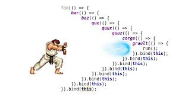
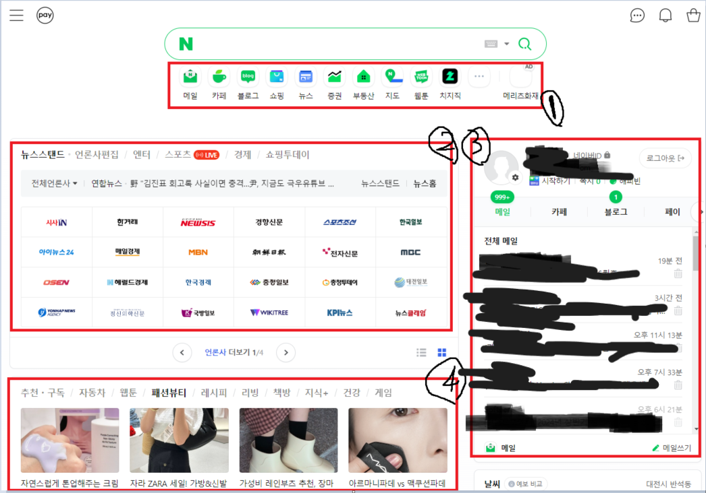

# 비동기 프로그래밍이란?

### 비동기란?

비동기 프로그래밍이란 특정 코드의 처리가 완료되기 전, 처리하는 도중에도 아래로 계속 내려가며 수행을 하는 것이다.

아래 예시를 통해 알아보겠습니다.

```jsx
function func(){
    setTimeout(()=>{
        console.log(1)
    },1000)
}
func();        //1번
console.log(2) //2번
console.log(3) //3번

// 2
// 3
// 1
```

기본적인 프로그래밍은 위부터 아래로 순서대로 실행되지만, 

비동기로 처리하게되면 실행을 하면 기다리는것이 아닌, 아래로 내려가며 수행을 계속 하는것을 볼 수 있습니다.

## 비동기 방식


이러한 비동기는 작업을 동시에 진행해야할때(api호출같은경우) 사용됩니다.

### 콜백방식

mdn→ 프로그래밍에서 콜백(callback) 또는 콜백 함수(callback function)는 다른 코드의 인수로서 함수를 넘겨주고 실행할 수 있다는것을 말합니다.

```jsx
const func = () =>{
    	console.log("2");
    }
console.log("1");
setTimeout(func, 5000);
console.log("3");

//1
//3
//2
```

func 함수에 대해서 5초가 지나고 나서 2가 실행됩니다.

### 콜백의 약점

- 콜백 헬 상태 발생



콜백헬은 비동기를 동기처럼 사용하고 싶을때 발생합니다

아래 예시는 순서대로 0.5초씩 출력됩니다.

```jsx
function func2(word,callback){
    setTimeout(()=>{
        console.log(word)
        callback();
    },500)
}

func2("SAMSUNG",()=>{
    func2("SW",()=>{
        func2("ACADEMY",()=>{
            func2("FOR",()=>{
                func2('YOUTH',()=>{})
            })
        })
    })
})
SAMSUNG
SW
ACADEMY
FOR
YOUTH
```

보기에 불편하죠?

## 프로미스의 등장

mdn → 비동기 작업이 맞이할 미래의 완료 또는 실패와 그 결과 값을 나타냅니다.

```jsx
//대기(pending): 이행하지도, 거부하지도 않은 초기 상태.
//이행(fulfilled): 연산이 성공적으로 완료됨.
//거부(rejected): 연산이 실패함.

const myPromise = new Promise( (resolve,reject)=>{
    setTimeout( ()=>{
        const text ="성민";
        console.log("예약 함수 호출")
        if(text === '성민'){
            resolve("이름은 성민 입니다")
        }
        else{
            reject("이름은 성민이 아닙니다")
        }
    },2000)
})

// resolve -> then
// then은 프로미스 객체를 반환합니다
myPromise.then( (result)=>{
    console.log(result);
}).
// reject -> catch
catch((err)=>{
    console.log(err);
})
.finally(()=>{
    console.log()
})
```

## 프로미스 체이닝

```jsx
function delay_word(word, delay) {
  return new Promise(resolve => {
    setTimeout(function (){
      resolve(word)
    }, delay)
  })
}

delay_word('SAMSUNG', 500)
.then((result) => {
    console.log(result)
    return delay_word('SW', 500);
})
.then((result) => {
    console.log(result)
    return delay_word('FOR', 500)
})
.then((result) => {
    console.log(result)
    return delay_word('YOUTH', 500)
})
.then((result) => {
    console.log(result)
    return delay_word('SW', 500);
})
.then((result) => {
    console.log(result)
})

SAMSUNG
SW
ACADEMY
FOR
YOUTH
```

위에 방법도 나중에는 길어질 수 있습니다

### async-await

```jsx
async function test(){
	const resolve_0 = await delay_word('SAMSUNG', 500) 
	console.log(resolve_0)
	const resolve_1 = await delay_word('SW', 490)
	console.log(resolve_1)
	const resolve_2 = await delay_word('ACADEMY', 480)	
	console.log(resolve_2)
	const resolve_3 = await delay_word('FOR', 470)
	console.log(resolve_3)
	const resolve_4 = await delay_word('YOUTH', 460)
	console.log(resolve_4)
}
test()

SAMSUNG
SW
ACADEMY
FOR
YOUTH
```

async는 함수 앞에 위치하고, 항상 프라미스를 반환합니다.

await는 async 함수 내에서만 사용이 가능하고, await는 프라미스가 처리될때까지 기다리게 합니다.

awiat를 하는동안 cpu는 다른일을 합니다

### 그러면 then이랑 await는 같은건가요?

```jsx
delay_word('SAMSUNG', 500).then(
		(result)=>{console.log(result)}
)
const resolve_1 = await delay_word('SW', 60)
console.log(resolve_1)

//SW
//SAMSUNG
```

then은 then then(체이닝)으로 엮지 않으면 비동기로 작동합니다.

- 개선된 방향이 콜백함수 → 프로미스 → async/await

보통의 경우 async/await를 사용하는것을 권장합니다(이해하기 편하다)

## Promise.all() vs async await

보통 비동기작업은 api를 호출할때 진행됩니다.



만약 위 홈페이지가 있다고 치자

1, 2, 3, 4가 api호출이라고 가정해보자

async await를 사용하게되면 1,2,3,4를 순서대로 api를 호출하게된다.

그러면 사용자는 1,2,3,4가 호출될동안 기다려야한다

그런데 각각이 독립적인 api호출이라면 전부다 기다릴 필요가 없다는것을 알 수 있을겁니다.

이러한 문제를 promise.all() 메소드로 해결이 가능합니다.

```jsx
const promise2 = () => {
    return new Promise((resolve) => {
        setTimeout(() => {
          resolve(4000)
        }, 3000) //3초가 걸리는 api
      })
}
const promise3 = () => {
    return new Promise((resolve) => {
        setTimeout(() => {
          resolve(4000)
        }, 3000) //3초가 걸리는 api
      })
}
```

- async-await 함수

```jsx
async function asyncTest(){
    const promises2 = await promise2(); //3
    const promises3 = await promise3(); //3
    console.timeEnd("측정"); //측정: 6.011s
}
asyncTest();
```

- promiseall로 병렬처리

```jsx
Promise.all([promise2(), promise3()])
.then(() => {
    console.log("All promises resolved");
    console.timeEnd("측정"); //측정: 3.024s
})
```

지금은 3초의 차이를 가지는 예시지만 api가 많아질수록 차이가 더 커질 것입니다.

개발을 하면서 각 api가 독립적이라면 병렬처리도 생각해보면 좋을 것 같습니다!
